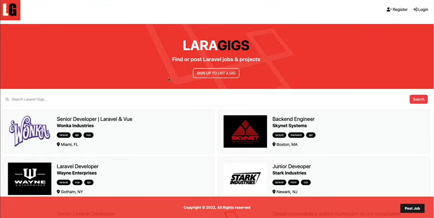

# laragigs



laragigs is a Job portal Web Application, built with Laravel 11, and Tailwind CSS.

## Installation

1. Download the code by clicking **Code**, **Download ZIP**. Or if you have Git install in your machine, you can run this in your terminal.

```
git clone https://github.com/devmuhammadzaki/laragigs.git
```

2. Change directory to your local copy of `laragigs` in your terminal. Then install composer dependencies.

```
composer install
```

3. Install frontend dependencies.

```
npm install
```

4. Copy `.env` file from `.env.example`. In NIX machine you can use this command.

```
cp .env.example .env
```

5. Prepare a database. You can use this command.

```
mysql -uroot -e "CREATE DATABASE laragigs_db"
```

If you have password for your database, you need to specify `-p` on the command.

6. Configure your database in `.env`

```
DB_CONNECTION=mysql
DB_HOST=127.0.0.1
DB_PORT=3306
DB_DATABASE=laragigs_db
DB_USERNAME=root
DB_PASSWORD=
```

7. Migrate database tables and seed them with fake data

```
php artisan migrate --seed
```

8. Generate a key for you application

```
php artisan key:generate
```

9. Link storage (for photos and icons associated with the project)

```
php artisan storage:link
```

10. Run php development server

```
php artisan serve
```

11. Run node.js development server (alongside php server)

```
npm run dev
```

Your local copy of laragigs is ready to access in your browser ;)
